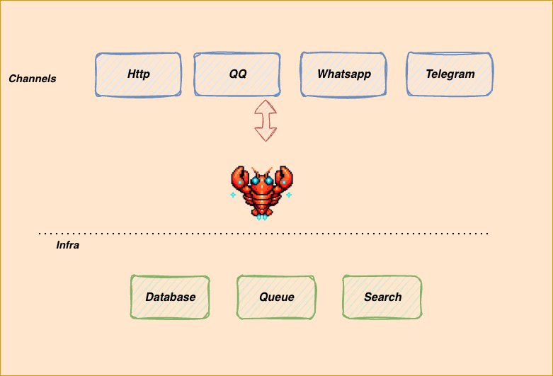

  
  <h1>clawbot: Lightweight Personal AI Assistant with more infrastructure</h1>

🦞 **clawbot** is a **lightweight** personal AI assistant built on top of [Nanobot](https://github.com/HKUDS/nanobot)

## 🏗️ Architecture

  

